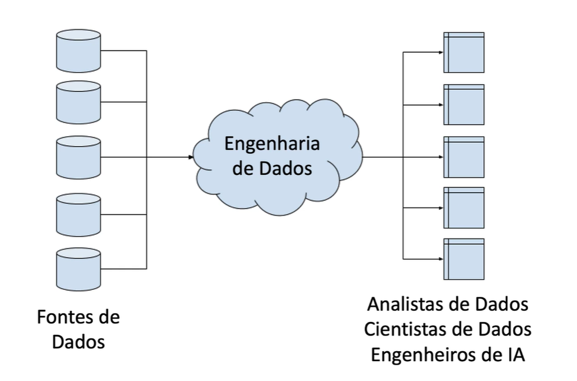

# O Que é Data Eng em uma imagem 

Conjunto de tecnicas etapas processos procedimentos que permitem pegar dados no formato bruto e entregar esses dados em um formato ultilizavel 

Ajudando Data Analyst, Data Scients, Data Eng...

Os  Engenheiros  de  Dados  devem  entender  os  conceitos  fundamentais  em  ciência  da computação e devem ser bem versados na construção e concepção de aplicações em grande escala; de ponta a ponta.

Eles devem entender os prós e os contras da utilização de bancos de dados relacionais e NoSQL, eles devem saber como projetar soluções para casos de uso com dados em lote (Batch) e fluxo contínuo (Streaming de Dados), eles devem saber o que é preciso para operacionalizar um  modelo  preditivo  e  como  ajudar  a  publicar  esses  modelos  criados  no  “laboratório” (treinamento e validação) para aplicações em tempo real.

Eles  devem  entender  a  computação  distribuída  e  ambientes  em  cluster  e  devem  ser capazes de trabalhar com o Cientista de Dados e Engenheiro de IA para ajudar a construir a infraestrutura de armazenamento e processamento de dados.Eles  devem  saber  quando  definir  esquemas  para  o  aplicativo  a  fim  de  implementar projetos de “Data Lakes” que ajudem na análise em grande escala, mas ainda atendam aplicativos específicos dedomínio.Eles devem ainda conhecer sobre governança e segurança de dados e eles devem estar muito familiarizados com as principais tecnologias que são usadas para construir esses sistemas.Para  trabalhar  como Engenheiro  de  Dadosé  preciso  ter  perfil  técnico,  gostar  de computação,  dominar  o  uso  de  sistemas  operacionais  (especialmente  Linux)  e  desenvolver habilidades nas técnicas, procedimentos e ferramentas usados em engenharia de dados.

O  Cientista  de  Dados  desenvolve  modelos  e  realiza  análises  usando  Matemática, Estatística, Programação e Machine Learning para explicar e prever comportamentos complexos, resolvendo problemas das áreas de negócio, no mundo real.

Um  Engenheiro  de  Dados  projeta  e  constrói  arquiteturas  de  dados  e  pipelines  para ingestão, armazenamento, processamento e execução de aplicações de grande escala com Big Data