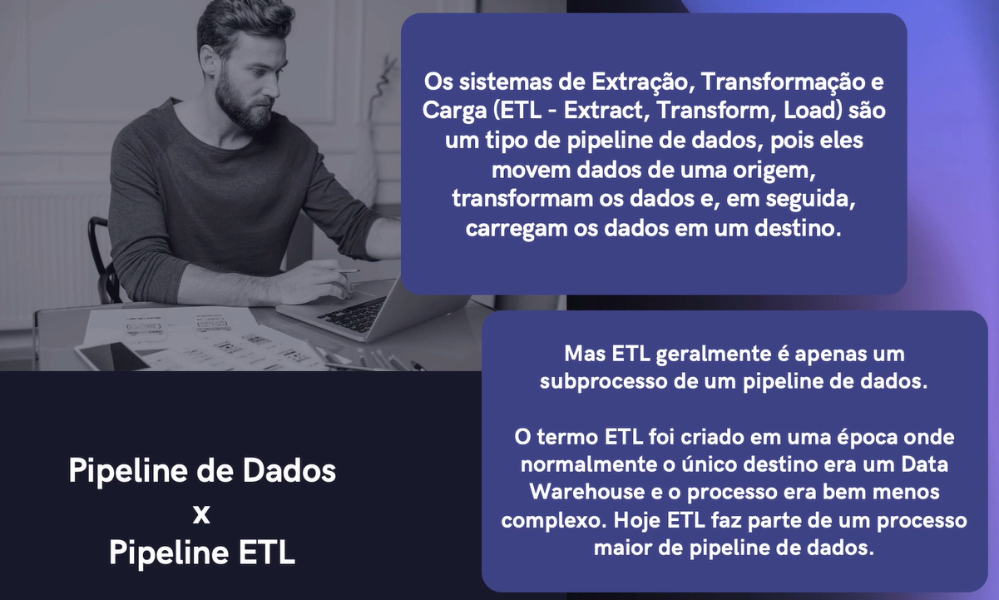
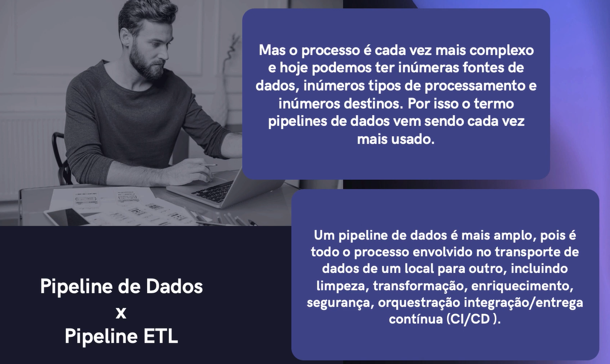
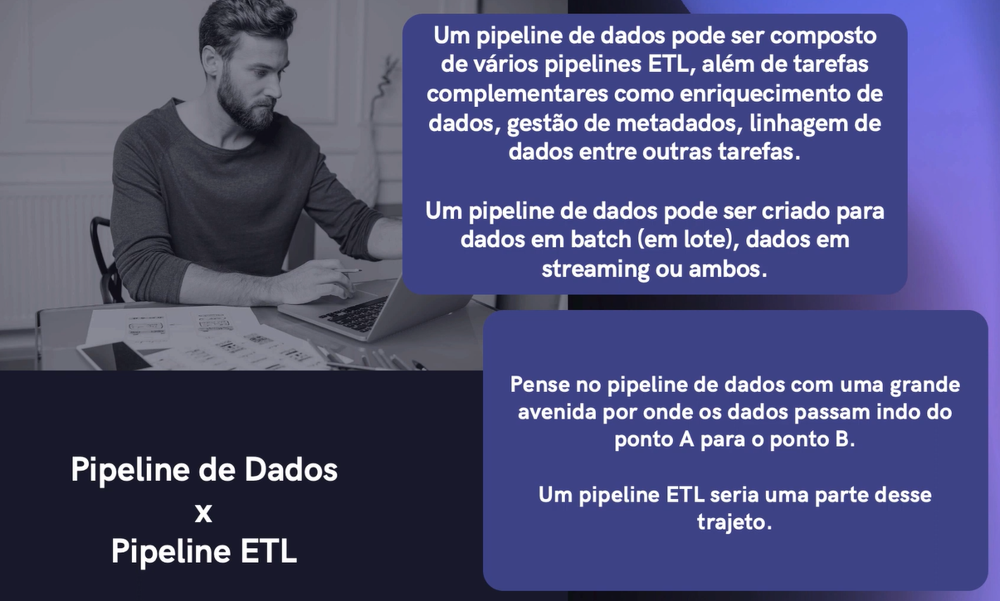

# Pipeline

Transportar algo da entrada a saida  -- De um lado a outro

Pode ser mover os dados de uma Origem para um Destino (Data Warehouse / Data Lake)

Em Dados de Streaming o ciclo de Vida é menor

Ao longo do caminhoos dados são transformados e otimizados chegando a um estado em que pode ser analisado e usado

Um pipeline de dados é essencialmente o conjunto de etapas envolvidas na agregação organização e movimentação dos dados

Os pipeline modernos automatizam muitas tarefas

Normalmente o pipeline inclui carregar dados brutos em uma tabela de preparação (área intermediária ou Staging Area)
para armazenamento temporário e, em seguida alterá-los antes de inseri-los no destino.

**Resumindo Pipeline**
Um Pipeline de dados é uma série de etapas de processamento de dados

## De onde vem os dados

De onde quiser
1. Banco Relacional
2. Banco Não Relacional 
3. Pagina Web
4. Aplicação Web ou Desktop
5. Redes Sociais
6. Formato txt, pdf

Depende como a origem está
Normalmente a empresa gera uma plataforma de dados que permite que você crie e execute os pipelines

---

## Componentes Pipeline

#### Origem 

Origem é a fonte dos dados, ele é o inicio do Pipeline e muitos problemas comum são, mais de 1 fonte de dados em formatos diferetes

LGPD, GDPR -> Vamos coletar todos os dados disponiveis??

É uma etapa menos glamurosa porém importantissima

#### Processamento 

Parte Glamurosa -> Processamento, limpeza dos dados, transformação, enriquecimento dos dados 

Quando modificamos por exemplo pequeno label, ou adiciona meta dados, ou transformações nos dados vizando facilitar depois o processo de analise

Sem duvida essa vai ser a mais complexa e a mais extensa 
Vai depender do objetivo de cada pipelie
Podemos criar varios pipelines em uma empresa cada um atendendo a um projeto ou objetivo especifico!

###### Cada Finalizade (Dashboard, Modelo Machine Learn) tem seu proprio Pipeline Cumprindo seu Objetivo!

#### Destino

Aonde vou colocar os dados depois de Processamento, limpados, transformados, enriquecidos??

A empresa tem que definir
Podemos colocar em um data lake, data Warehouse, Data Store, Ambiente local ou nuvem OU em **tempo Real**

---

# Pipeline de Dados X Pipeline ETL

#### Batch X Streaming

---

